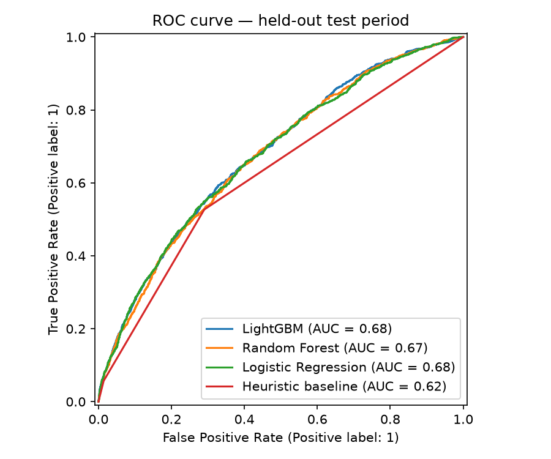
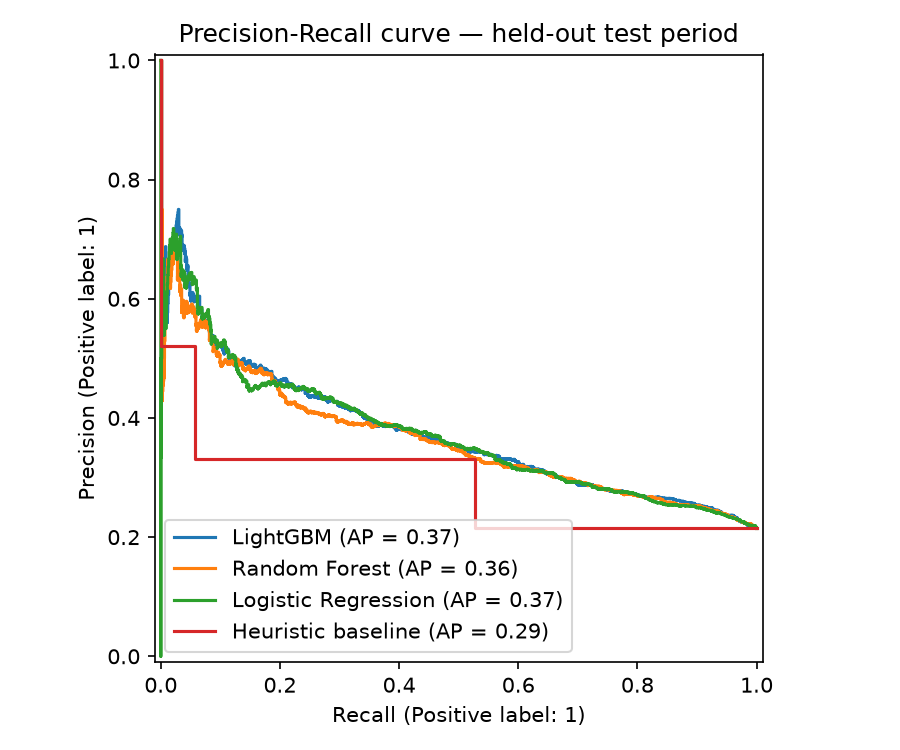
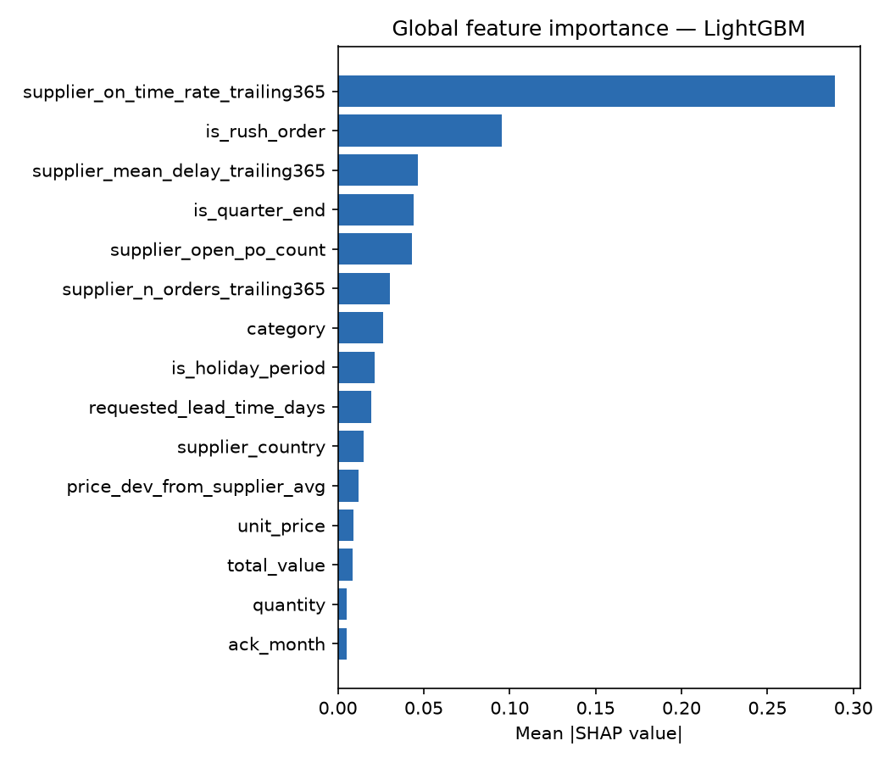

# Purchase Order Delay Risk Prediction

Predicts the risk that an open purchase order (PO) will arrive late, and translates
that risk into concrete buyer/planner actions (check-in, escalate, expedite).
End-to-end: synthetic data generation → leakage-safe features → baseline & candidate
models → time-based validation → SHAP explainability → error analysis → a documented
decision framework.

**All data is synthetic.** No real employer, supplier, or client data is used
anywhere in this repository — see [`data/README.md`](data/README.md) for the
generation methodology and [`docs/model_card.md`](docs/model_card.md) for what these
results do and do not demonstrate.

## Results

Single run, `seed=42`, 40,000 synthetic PO lines, chronological 70/15/15 split
(test set n=6,000):

| Model | ROC-AUC | PR-AUC | Precision@10% |
|---|---|---|---|
| Heuristic baseline (planner rule) | 0.623 | 0.287 | 0.383 |
| Logistic Regression (scaled features) | 0.676 | 0.372 | 0.455 |
| Random Forest | 0.674 | 0.365 | 0.438 |
| **LightGBM (selected)** | **0.679** | **0.375** | **0.458** |

Note: Logistic Regression's numbers jumped substantially (0.609 → 0.676 ROC-AUC) once
numeric features were standardized before fitting — a reminder that a "weak" linear
baseline is sometimes just an unscaled one. With scaling, all three ML models land
within ~1 point of ROC-AUC of each other; LightGBM is still selected for its
consistently best ranking metrics.





Full metrics: [`reports/metrics.json`](reports/metrics.json). A known calibration
caveat with the class-weighted models is documented (not hidden) in
[`docs/model_card.md`](docs/model_card.md#known-limitation-calibration).

## Why this is hard (and not just an AUC-chasing exercise)

- **Leakage safety**: every feature is checked against a hard-coded leakage list
  (`config.LEAKAGE_COLUMNS`) and enforced by `assert_no_leakage` plus dedicated tests
  (`tests/test_leakage.py`). Supplier trailing-reliability features are computed using
  only prior orders' *already-delivered* outcomes, not future information — see the
  design note in `src/po_delay/data_generation.py`.
- **Time-based validation**: chronological train/val/test split, not random k-fold,
  because delay risk drifts over time (seasonality, supplier mix). See
  `src/po_delay/validation.py`.
- **Decisions, not just scores**: `src/po_delay/decision_rules.py` maps a probability
  to a risk tier and a specific buyer action, and includes an illustrative
  cost-sensitive threshold sweep — with the synthetic cost assumptions clearly
  labeled as illustrative.

## Quickstart

```bash
python -m venv .venv && source .venv/bin/activate   # or .venv\Scripts\activate on Windows
pip install -e ".[dev]"

# Run the full pipeline: generate data, train all models, save charts + metrics
PYTHONPATH=src python scripts/run_pipeline.py

# Run the test suite
pytest --cov=po_delay
```

Or explore interactively via the notebooks in [`notebooks/`](notebooks/) (`01_eda`,
`02_feature_engineering`, `03_modeling`, `04_explainability`).

## Repository structure

```
├── data/                  synthetic data + data dictionary (data/README.md)
├── sql/                   schema + leakage-safe feature queries
├── src/po_delay/          data generation, features, validation, models, explain, decision_rules
├── scripts/run_pipeline.py  end-to-end reproducible run (data -> models -> charts)
├── notebooks/             EDA, feature engineering, modeling, explainability
├── tests/                 unit tests incl. explicit leakage + time-order guards
├── reports/               metrics.json, feature importance, error analysis, figures/
├── docs/model_card.md     intended use, results, limitations, safe claims
└── .github/workflows/     CI: lint, format check, tests + coverage, pipeline smoke test
```

## Testing & CI

`pytest` covers data generation determinism, feature leakage guards, time-split
correctness, all four models' fit/predict paths, and the decision-rule tier mapping
(32 tests, see `tests/`). GitHub Actions (`.github/workflows/ci.yml`) runs lint
(ruff), format check (black), the full test suite with coverage, and an end-to-end
pipeline smoke test on every push/PR.

## Limitations

- Synthetic data reflects the author's assumptions about delay drivers, not a real
  supply chain — see `docs/model_card.md` for the full limitations list and which
  portfolio claims are and are not safe to make from this project.
- No production deployment; no evidence of real business impact or cost savings.

## License

MIT — see [`LICENSE`](LICENSE).
